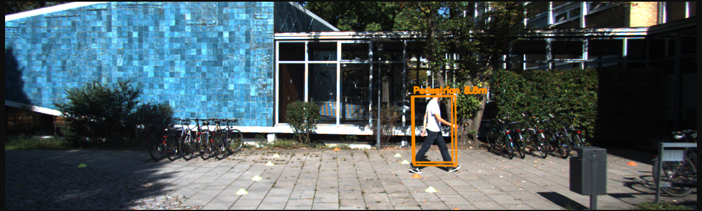
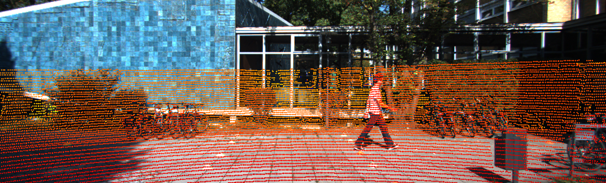
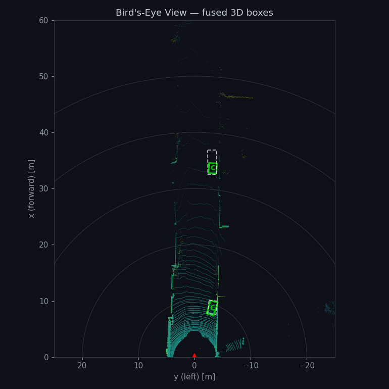

# Multi-Sensor LiDAR × RGB Fusion — Training-Free 3D Object Detection

A complete **camera + LiDAR sensor-fusion pipeline** that detects objects in 3D on the
KITTI autonomous-driving dataset — **without training any 3D network**. It fuses the
*semantics* of a pretrained 2D image detector (YOLOv8) with the *geometry* of the
Velodyne LiDAR point cloud to produce oriented 3D bounding boxes, and ships with an
animated **Flask web app** for interactive exploration.



> Predicted 3D box (orange) on KITTI frame `000000` — produced by projecting LiDAR
> points into YOLOv8's 2D detection, segmenting the object, and fitting an oriented box.

---

## Why this approach?

Training a LiDAR detector like PointPillars needs a GPU and hours of compute. This
project instead does **late fusion**: it leans on a *pretrained* image detector for the
hard semantic problem ("is that a pedestrian?") and uses LiDAR purely for geometry
("exactly where and how big is it?"). The result runs on a **CPU in ~2 seconds per
frame** and still recovers accurate metric 3D boxes.

| | RGB camera | LiDAR | Fusion (this project) |
|---|---|---|---|
| Class / semantics | ✅ strong | ❌ weak | ✅ from camera |
| Metric depth & size | ❌ ambiguous | ✅ accurate | ✅ from LiDAR |
| Needs training | uses pretrained YOLOv8 | — | **none** |

---

## Pipeline

```
 RGB image ─► YOLOv8 (pretrained) ─► 2D boxes ─┐
                                               ├─► Frustum association
 Velodyne ──► calibration projection ──────────┘        │
   point        (P2 · R0 · Tr_velo→cam)                  ▼
   cloud                                      ground removal (RANSAC)
                                                         │
                                                         ▼
                                              DBSCAN cluster ─► oriented
                                              (pick nearest)    3D box (BEV
                                                                min-area rect
                                                                + z-extent)
                                                         │
                                                         ▼
                                          KITTI-format 3D detection + BEV IoU eval
```

1. **2D detection** — `YOLOv8n` (COCO-pretrained) runs on the RGB image; COCO classes
   are remapped to KITTI's `Car / Pedestrian / Cyclist`.
2. **Calibration projection** — every LiDAR point is projected into the image with the
   KITTI calibration chain `P2 · R0_rect · Tr_velo→cam`.
3. **Frustum association** — for each 2D box, the LiDAR points landing inside it form a
   viewing frustum (the object plus some background/ground).
4. **Ground removal** — a RANSAC plane fit in the Velodyne frame strips the road.
5. **Clustering** — DBSCAN groups the remaining points; the nearest dominant cluster is
   taken as the object.
6. **3D box fitting** — a minimum-area rectangle in the bird's-eye plane gives heading
   and footprint; the z-extent gives height → an oriented KITTI 3D box.
7. **Evaluation** — predicted boxes are matched to ground truth by bird's-eye-view IoU
   to report precision / recall / mean IoU.

---

## Results (sample frames)

Measured on the bundled real KITTI frames (matched at **BEV IoU ≥ 0.25**):

| Frame | Object | Predicted location (x,y,z) m | Ground-truth location | BEV IoU |
|------|--------|------------------------------|-----------------------|---------|
| 000000 | Pedestrian | (1.77, 1.28, **8.37**) | (1.84, 1.47, **8.41**) | **0.59** |
| 000002 | Car (near) | (3.17, 1.73, **8.44**) | (3.23, 1.59, **8.55**) | 0.37 |
| 000002 | Car (far, 34 m) | (3.27, 1.94, 33.3) | (3.18, 2.27, 34.4) | — |

Depth/position error is **on the order of centimetres** for nearby objects — the LiDAR
geometry is doing exactly what fusion promises. (Far objects with very few returns are
harder, as expected for any LiDAR method.)

| LiDAR → image projection | Bird's-eye view (pred = green, GT = dashed) |
|---|---|
|  |  |

---

## Quick start

```bash
# 1. Install dependencies (CPU-only is fine)
pip install -r requirements.txt

# 2. Fetch a few real KITTI sample frames (image + LiDAR + calib + labels)
python scripts/download_sample.py --out data/kitti

# 3a. Launch the interactive web app  ── open http://localhost:5000
python app.py

# 3b. ...or run headless from the CLI (writes images + KITTI predictions to outputs/)
python scripts/run_fusion.py --data_dir data/kitti --all --out outputs
```

The first run auto-downloads the ~6 MB `yolov8n.pt` weights via Ultralytics.

### Web app

The Flask UI (`app.py`) lets you pick a frame, run the fusion, and watch each stage of
the pipeline light up. It shows the RGB image, the depth-colored LiDAR projection, the
2D detections, the fused 3D boxes, a live bird's-eye view, a detections table, and the
BEV evaluation against ground truth — with animated transitions throughout.

---

## Using the full KITTI dataset (~41 GB)

The bundled sample is 3 frames. For the full **KITTI 3D Object Detection** set
(7481 training frames):

1. Register at <https://www.cvlibs.net/datasets/kitti/eval_object.php> (or use the
   public AWS mirror at `s3.eu-central-1.amazonaws.com/avg-kitti/`).
2. Download *left color images* (`image_2`, 12.6 GB), *Velodyne point clouds*
   (28.8 GB), *camera calibration* (27 MB), and *training labels* (5.6 MB).
3. Unzip so the layout matches:
   ```
   data/kitti/training/{calib,image_2,velodyne,label_2}/{000000..007480}.*
   ```
4. Everything (`app.py`, `run_fusion.py`) auto-discovers all frames present — no code
   changes needed.

---

## Project layout

```
├── app.py                       # Flask web app (REST API + serves the UI)
├── templates/index.html         # single-page UI
├── static/{style.css,app.js}    # animated frontend
├── scripts/
│   ├── download_sample.py        # fetch real KITTI sample frames
│   ├── run_fusion.py             # headless CLI for the full pipeline
│   └── visualize_projection.py   # standalone LiDAR-projection sanity check
└── src/
    ├── data/kitti_loader.py      # KITTI image/LiDAR/calib/label parsing
    ├── calibration/project_lidar.py  # velo↔rect transforms, projection, box corners
    ├── detection/yolo_detector.py    # YOLOv8 wrapper + COCO→KITTI mapping
    ├── fusion/frustum_fusion.py      # ground removal, clustering, 3D box fitting
    ├── fusion/metrics.py             # BEV-IoU evaluation vs ground truth
    ├── visualization/draw.py         # 3D boxes on image + BEV renderer
    └── pipeline.py                   # ties it all together
```

---

## Tech stack

Python · PyTorch · Ultralytics YOLOv8 · OpenCV · scikit-learn (DBSCAN) · NumPy ·
Matplotlib · Flask · KITTI

---

## Résumé summary

> **Multi-sensor 3D object detection (LiDAR + camera fusion).** Built a training-free
> 3D detection pipeline on the KITTI dataset that fuses a pretrained YOLOv8 2D detector
> with Velodyne LiDAR: projecting point clouds via the camera-calibration matrices,
> associating points to detections by viewing frustum, removing the ground plane with
> RANSAC, clustering with DBSCAN, and fitting oriented 3D boxes. Achieved
> centimetre-level localization on nearby objects (BEV IoU up to 0.59), evaluated against
> KITTI ground truth, and shipped an animated Flask web app for interactive
> visualization. Runs in ~2 s/frame on CPU.
