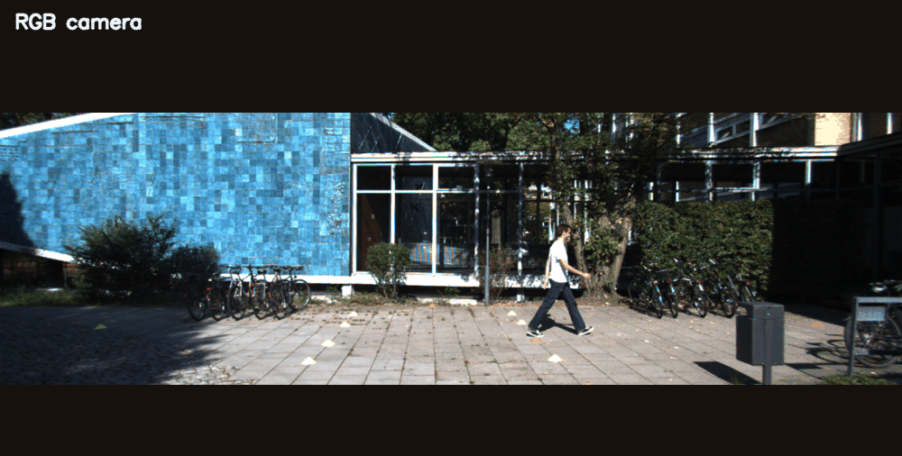
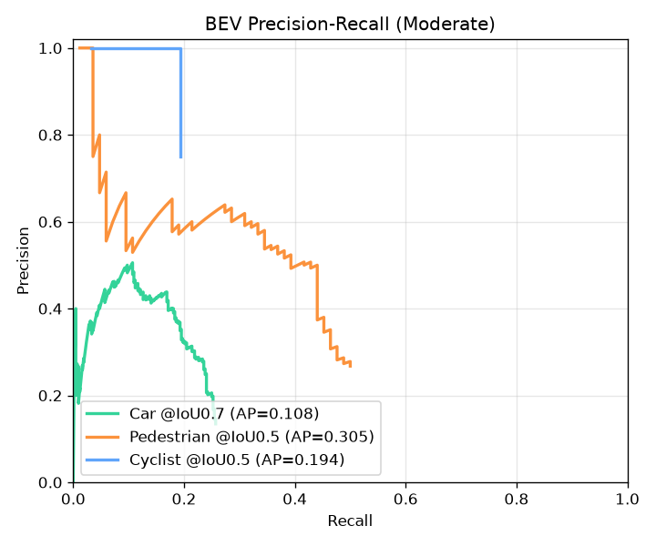

# Multi-Sensor LiDAR × RGB Fusion — Training-Free 3D Object Detection

A complete **camera + LiDAR sensor-fusion pipeline** that detects objects in 3D on the
KITTI autonomous-driving benchmark — **without training any 3D network**. It fuses the
*semantics* of a pretrained 2D image detector (YOLOv8) with the *geometry* of the
Velodyne LiDAR point cloud to produce oriented 3D bounding boxes, is evaluated against
ground truth with the **standard KITTI protocol**, and ships with an animated **Flask web
app** for interactive exploration.



---

## Highlights

- **Accurate 3D localization, no training.** On matched detections (KITTI *Moderate*,
  200 frames): **median BEV IoU 0.75**, **median center error 0.16 m (16 cm)**.
- **Real sensor fusion.** LiDAR is projected through the full KITTI calibration chain
  `P2 · R0_rect · Tr_velo→cam`; points inside each 2D detection form a frustum that is
  segmented and fit to an oriented 3D box.
- **Rigorous evaluation.** Bird's-eye-view Average Precision per class and per difficulty
  (Easy/Moderate/Hard) with the official KITTI ignore rules (neighbour classes, DontCare
  regions), plus precision-recall curves.
- **Learned box head.** A trained PointNet (Frustum-PointNet-style) halves BEV center error
  vs the geometric fitter *on GT-box frustums* (1.96 → 1.09 m) — rigorously benchmarked,
  including an honest deployment gap on detector boxes.
- **Multi-object tracking.** SORT (Kalman + Hungarian) assigns stable IDs across a KITTI
  tracking sequence.
- **Runs on CPU** (~1–2 s/frame) and ships as a **Dockerized web app** deployable to a
  free public URL.


> KITTI frame `000000`: the walking pedestrian gets an oriented 3D box fit from the LiDAR
> points inside YOLOv8's 2D detection — placed at 8.8 m with correct height and heading.

---

## Why this approach?

Training a LiDAR detector like PointPillars needs a GPU and hours of compute. This
project instead does **late fusion**: it leans on a *pretrained* image detector for the
hard semantic problem ("is that a pedestrian?") and uses LiDAR purely for geometry
("exactly where, how big, which way is it facing?").

| | RGB camera | LiDAR | Fusion (this project) |
|---|---|---|---|
| Class / semantics | ✅ strong | ❌ weak | ✅ from camera |
| Metric depth, size, heading | ❌ ambiguous | ✅ accurate | ✅ from LiDAR |
| Needs training | uses pretrained YOLOv8 | — | **none** |

---

## Pipeline

```
 RGB image ─► YOLOv8 (pretrained) ─► 2D boxes ─┐
                                               ├─► Frustum association
 Velodyne ──► calibration projection ──────────┘        │
   point        (P2 · R0 · Tr_velo→cam)                  ▼
   cloud                                      RANSAC ground-plane removal
                                                         │
                                                         ▼
                                              DBSCAN cluster (nearest)
                                                         │
                                                         ▼
                                     oriented 3D box: BEV min-area rectangle for
                                     heading, ground-referenced height, extent
                                     refined to class priors, re-anchored to the
                                     observed near face
                                                         │
                                                         ▼
                                    KITTI-format 3D detections + BEV-AP evaluation
```

1. **2D detection** — `YOLOv8s` (COCO-pretrained) on the RGB image. COCO vehicles map to
   `Car`; a `person` overlapping a two-wheeler becomes a `Cyclist` (their union box),
   otherwise a `Pedestrian` — matching KITTI's definition of a cyclist as a *rider*, not a
   parked bike.
2. **Calibration projection** — every LiDAR point is projected into the image via
   `P2 · R0_rect · Tr_velo→cam`.
3. **Frustum association** — points landing inside a 2D box form that object's frustum.
4. **Ground removal** — RANSAC fits the road plane in the Velodyne frame and removes it.
5. **Clustering** — DBSCAN groups the remaining points; the nearest dominant cluster is
   the object.
6. **3D box fitting** — a minimum-area rectangle in the bird's-eye plane gives heading;
   height is referenced to the ground plane. Because a single sweep only sees an object's
   near faces, **extent is largely determined by KITTI class-size priors** (the LiDAR
   contributes position and heading, not full extent) and the box is re-anchored so it
   grows *away* from the sensor to align with the observed near face.
7. **Evaluation** — predictions are matched to ground truth by bird's-eye IoU under the
   KITTI protocol.

---

## Results — 200 KITTI frames

Bird's-eye-view Average Precision (VOC all-point AP), **standard KITTI protocol**
(neighbour classes & DontCare regions ignored). IoU thresholds: Car 0.7, Ped/Cyclist 0.5.

| Class | IoU | Easy | Moderate | Hard |
|-------|:---:|-----:|---------:|-----:|
| Car        | 0.7 | 0.188 | 0.108 | 0.090 |
| Pedestrian | 0.5 | 0.353 | 0.305 | 0.267 |
| Cyclist    | 0.5 | 0.222 | 0.194 | 0.212 |
| **mAP**    |     |       | **0.202** | |

**Localization quality** (matched detections, Moderate, IoU ≥ 0.5):
**median BEV IoU 0.75 · median center error 0.16 m · recall 0.32**.



### How to read this honestly

The pipeline **localizes very accurately when it fires** (16 cm median center error). Note
that this measures **position and heading** — the two quantities the LiDAR actually
recovers; object *extent* is prior-dominated (see pipeline step 6), so the IoU/center-error
figures reflect placement, not size estimation. The headline limiter is **recall** —
bounded by (a) the pretrained 2D detector missing small/occluded objects and (b) LiDAR
sparsity beyond ~40 m, where distant objects return too few points to cluster. AP is
recall-bounded accordingly. Two clean, measured improvements got it here:

| Change | mAP@0.5 (overall protocol) |
|--------|:--:|
| Baseline (visible-surface box fit) | 0.045 |
| **+ ground-referenced height, class-prior extent, near-face re-anchoring** | **0.132** (~3×) |

Natural next steps to raise recall (not yet done): fine-tune YOLO on KITTI, or add a
learned box head (Frustum-PointNet-style) on the frustum points.

<sub>Reproduce: `python scripts/evaluate_dataset.py --data_dir data/kitti --out docs`
(regenerates `docs/EVALUATION.md`, `docs/evaluation.json`, and the PR-curve figure).</sub>

---

## Learned 3D box head (Frustum-PointNet)

As an alternative to the geometric box fitter, a compact **PointNet** is trained to
regress the 3D box directly from the frustum points (viewpoint-normalized, size
residuals against a class anchor — following Frustum-PointNet, Qi et al. 2018). Both
methods consume the *same* GT-2D-box frustums, so the comparison isolates the box
estimator. Trained on 618 objects (200 frames), evaluated on a **frame-level** split of
150 val objects:

| Term | Geometric fitter | **Learned PointNet** |
|------|:---:|:---:|
| Median BEV center error | 1.96 m | **1.09 m** |
| Median heading error | **0.34 rad** | 0.37 rad |
| Median size ratio (pred/GT) | 1.01 | 0.99 |

The learned head **roughly halves center error** — it recovers position from partial,
single-view point clouds better than clustering + rectangle fitting does — while heading
and size tie (size is anchor-driven for both). This is a genuine learned improvement, with
an honest ceiling: only 200 frames of training data, and val counts of **Car 123,
Pedestrian 20, Cyclist 7** — the non-Car numbers are too small to read per-class.

> **Population note:** these medians are over *all* 150 val objects (every GT-box
> frustum). They are **not** comparable to the 0.16 m figure in the Highlights, which is
> conditioned on a successful IoU ≥ 0.5 match — a population already selected for being
> well-localized. Unconditioned, 1.09 m is the harder number.

The learned head is **wired into the full pipeline** and selectable everywhere — the web-app
**3D HEAD toggle**, `run_fusion.py --head learned`, and `evaluate_dataset.py --head learned`.

### …but in deployment it underperforms — an honest negative result

Run end-to-end on **detector (YOLOv8) boxes** instead of GT boxes — same 200-frame KITTI
protocol — the picture flips:

| Head | mAP (Moderate) | Matched BEV IoU | Center err | Recall |
|------|:---:|:---:|:---:|:---:|
| **Geometric** (default) | **0.202** | **0.75** | **0.16 m** | **0.32** |
| Learned | 0.006 | 0.62 | 0.38 m | 0.28 |

The learned head was trained on *ground-truth* 2D-box frustums and **does not transfer to
detector boxes** at this data scale — a textbook train/deploy distribution shift, compounded
by no false-positive gating (it emits a box per detection) and only 200 training frames. So
the **geometric fitter stays the default.** The takeaway is honest: the model clearly learns
*in-distribution* (halved center error above), but making it help *in deployment* needs
2D-box-jitter augmentation, training on detector boxes, more data, and ideally the point
*segmentation* stage of real Frustum-PointNet. Building, wiring, and rigorously
benchmarking it — including reporting where it loses — is the deliverable.

A ready-to-run **Kaggle-GPU notebook** that retrains the head with **2D-box-jitter
augmentation** (+ point dropout/noise) on the full KITTI set — the fix for this exact gap —
is in [`notebooks/kaggle_train_frustum.ipynb`](notebooks/kaggle_train_frustum.ipynb). It trains
on GPU, then re-runs the deployment eval so you can see whether the gap closed.

```bash
python scripts/train_frustum.py --data_dir data/kitti --epochs 120   # trains + evaluates (CPU)
python scripts/run_fusion.py --idx 2 --head learned                  # run with the learned head
```
Trained weights: `models/frustum_pointnet.pt` (350 KB). Runs on CPU.

---

## Multi-object tracking (SORT)

On the KITTI **tracking** benchmark, detection → fusion → a **SORT** tracker (per-track
constant-velocity Kalman filter on the BEV center + Hungarian association by BEV-IoU)
assigns each object a stable ID across frames.


> Sequence 0000 — each object keeps its color/ID across frames; boxes shown on the image
> (top) and in the bird's-eye view with motion trails (bottom).

Over 70 frames of sequence 0000: **23 tracks**, **median length 3 frames**, longest
persisting **60 frames**, 4 tracks lasting ≥10 frames. The short median reflects
fragmentation — bounded by the same detector-recall limit as the detection AP, since a
missed detection can split a track into two IDs.

```bash
python scripts/download_tracking.py --seq 0000 --out data/kitti_tracking
python scripts/run_tracking.py --seq 0000 --data_dir data/kitti_tracking \
    --out docs/assets/tracking.gif
```

---

## Quick start

```bash
# 1. Install dependencies (CPU-only is fine)
pip install -r requirements.txt

# 2a. Fetch 3 real KITTI sample frames (fast) ...
python scripts/download_sample.py --out data/kitti
# 2b. ... or a larger subset for evaluation (~1 GB, partial-zip download, no 41 GB)
python scripts/download_subset.py --out data/kitti --n 200

# 3a. Launch the interactive web app  →  http://localhost:5000
python app.py

# 3b. ...or run headless (writes images + KITTI-format predictions to outputs/)
python scripts/run_fusion.py --data_dir data/kitti --all --out outputs

# 4. Aggregate evaluation (AP/mAP + PR curves)
python scripts/evaluate_dataset.py --data_dir data/kitti --out docs
```

The first run auto-downloads the YOLOv8s weights (~22 MB) via Ultralytics.

### Web app

Pick a frame, hit **Run Fusion**, and watch each pipeline stage light up. The UI shows the
RGB image, the depth-colored LiDAR projection, YOLOv8's 2D boxes, the fused **3D boxes**, a
live **bird's-eye view**, a detections table, and the BEV evaluation vs ground truth.

### Deploy

See [`deploy/DEPLOY.md`](deploy/DEPLOY.md). A `Dockerfile` is included; the app reads
`$PORT` (default 5000 local, 7860 in-container) so it drops straight onto Hugging Face
Spaces for a public demo URL.

---

## Using the full KITTI dataset (~41 GB)

The bundled sample is 3 frames; `download_subset.py` streams a few hundred more via
partial-zip extraction. For the full **KITTI 3D Object Detection** set (7481 frames):

1. Register at <https://www.cvlibs.net/datasets/kitti/eval_object.php> (or the public AWS
   mirror `s3.eu-central-1.amazonaws.com/avg-kitti/`).
2. Download *left color images* (`image_2`, 12.6 GB), *Velodyne* (28.8 GB), *calibration*
   (27 MB), *labels* (5.6 MB).
3. Unzip to `data/kitti/training/{calib,image_2,velodyne,label_2}/`. Everything
   auto-discovers all frames present.

---

## Project layout

```
├── app.py                       # Flask web app (REST API + serves the UI)
├── templates/index.html         # single-page UI
├── static/{style.css,app.js}    # animated frontend
├── Dockerfile, deploy/DEPLOY.md  # containerization + hosting
├── scripts/
│   ├── download_sample.py        # 3 real KITTI sample frames
│   ├── download_subset.py        # N detection frames via partial-zip extraction
│   ├── download_tracking.py      # one tracking sequence via partial-zip
│   ├── run_fusion.py             # headless pipeline CLI
│   ├── evaluate_dataset.py       # KITTI-protocol BEV-AP evaluation
│   ├── train_frustum.py          # train + evaluate the learned box head
│   ├── run_tracking.py           # SORT tracking demo -> GIF
│   └── make_demo_gif.py          # pipeline walkthrough GIF
└── src/
    ├── data/kitti_loader.py          # detection-split image/LiDAR/calib/label parsing
    ├── data/tracking_loader.py       # tracking-sequence loader (key/label normalization)
    ├── calibration/project_lidar.py  # velo↔rect transforms, projection, box corners
    ├── detection/yolo_detector.py    # YOLOv8 wrapper + COCO→KITTI (rider = Cyclist)
    ├── fusion/frustum_fusion.py      # ground removal, clustering, geometric 3D box fit
    ├── fusion/frustum_pointnet.py    # learned PointNet 3D box head
    ├── fusion/metrics.py             # BEV IoU, KITTI-protocol AP, difficulty
    ├── tracking/sort.py              # SORT: Kalman + Hungarian, stable track IDs
    ├── visualization/draw.py         # 3D boxes on image + BEV renderer
    └── pipeline.py                   # end-to-end orchestration
```

---

## Tech stack

Python · PyTorch (PointNet) · Ultralytics YOLOv8 · OpenCV · scikit-learn (DBSCAN) ·
SciPy (Hungarian, Kalman) · NumPy · Matplotlib · Flask · Docker · KITTI

---

## Résumé summary

> **Multi-sensor 3D object detection & tracking (LiDAR + camera fusion), KITTI.** Built a
> 3D detection pipeline fusing a pretrained YOLOv8 detector with Velodyne LiDAR —
> projecting point clouds through the camera-calibration matrices, associating points to
> detections by viewing frustum, RANSAC ground removal, DBSCAN clustering, and oriented 3D
> box fitting. Evaluated over 200 frames with the standard KITTI protocol (per-difficulty
> BEV AP); **median BEV center error 0.16 m** on matched detections. Additionally **trained
> a PointNet box head** (Frustum-PointNet-style) that halves center error on GT-box frustums
> (1.96 → 1.09 m) — with a rigorous end-to-end benchmark that honestly surfaces its
> train/deploy gap — and added **SORT multi-object tracking** (Kalman + Hungarian) with
> stable IDs across a tracking sequence. Shipped as a Dockerized Flask web app with an
> animated visualization UI. Runs on CPU.
